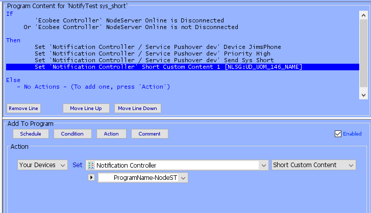

[](https://travis-ci.org/jimboca/udi-poly-notification)

# udi-poly-notification

This is the Notification Poly for the [Universal Devices ISY994i](https://www.universal-devices.com/residential/ISY) [Polyglot Interface](http://www.universal-devices.com/developers/polyglot/docs/) with  [Polyglot V2](https://github.com/Einstein42/udi-polyglotv2) to support sending many types of notifications for Pushover, Telegram, ISY Portal.

(c) JimBoCA aka Jim Searle
MIT license.

## Help

If you have any issues are questions you can ask on [PG3 Notification Nodeserver SubForum](https://forum.universal-devices.com/forum/316-notification/) or report an issue at [PG3 Notification Nodeserver Github issues](https://github.com/UniversalDevicesInc-PG3/udi-poly-notification/issues).

## Moving from PG2

There are a few ways to move

### Backup and Restore

The best way to move from PG2 to PG3 is to backup on PG2 and restore on PG3, but the only option is to do all your nodeservers at once.  I don't have much information on this method, if you have questions please ask on the PG3 forum.

### Delete and add

If you can't or don't want backup/restore then you can delete the NS on PG2 and install on the same slot on PG2.  Just remember to capture the config information before deleting. If all configuration data is entered exactly the same then ll node addresses will stay the same so all your programs should work after doing an update and save on each one, or rebooting the ISY, especially any using the Controller node since it's ST value has changed.  But, if you have nodes in any scene then it will have to be added back.

### Add then delete

Another option is to install in a new slot then go edit all your programs and scenes that reference the nodes and switch to the new slots. 

## Installation

Install from the Polyglot store.  

### Editions

There are 2 Editions available.  Free only supports the UDMobile node which will soon be available directly in the UDMobile app.  It is also limited to 8 messages per day.

## Configuration

All information is on the [Configuration Page](https://github.com/jimboca/udi-poly-notification/blob/master/POLYGLOT_CONFIG.md) which is the same as information included on the Polyglot Notification Nodeserver Configuration Page.

## How it works

The nodeserver allows you to
1. MESSAGES: Create short messages under Config and send them to a Notification Service easily thru an ISY program
2. NOTIFY NODES: Create a node that can be added to a scene to send canned messages when the scene is controlled
3. LARGE MESSAGES WITH SYSTEM VARIABLES: Send ISY Network resources to the nodeserver REST interface where recipients are controlled by a program which can include a large message body with system variables!
4. New in 3.3.0 [Short Custom Content](#short-custom-content)


## Notification Services

### ISY Portal

The ISY Portal Servie allows sending notifications to the Portal which are handled by the UD Mobile app.

Originally this service allowed sending to "devices" configured in the Portal, but as of version 3.5.2 the preference is to use groups.  To send messages to just one device, create a group with that device in it.  This allows you to change device names, or add a new phone to a group and remove the old phone.  Users who already have programs configured which reference devices can continue to use that, but should switch to groups at some point.

### Pushover 

Describe out to setup Pushover here... 

### Telegram

There is a very simple method to setup your own Telegram Bot.  This is initially a semi-manual process to create your own bot.  I will be researching and testing better ways to do this in the future.

First create your User Bot
1. Install Telegram on your computer or phone
    1. Will need to copy/paste a long key to PG3
1. Go to https://telegram.me/botfather
1. Command: /newbot
1. Answer questions:
    1. Bot Name: Any name you want
    1. User Name: Any username you want. 
1. botfather prints a line saying: Use this token to access the HTTP API:
    1. Copy and save that, you will need it for the configuring the nodeserver 
    1. Also save a permenant record of it somewhere, along with the link in the next step
1. You will also be given a link to your bot like t.me/{yourBotUsername}, click on it.
1. The "Start" will be shown, click that
1. Go to: [@RawDataBot](https://t.me/RawDataBot)
    1. Click Start
    1. This will give your user id listed under message -> from -> id
    1. Copy that to use in Nodeserver configuration

The tell the Notification Nodserver about it.
1. PG3 UI
1. Go to Notification Nodeserver Configuration
1. Click "Add Telegram User Bot Service Node"
1. Set the name
1. Paste the HTTP API Key from above
1. Paste your userid into the users (currently only one user is supported)
1. Click Save Changes


## Nodes

There are 3 types of nodes

### Notification Controller
This is the main node which contains the Status of the nodeserver and provides access to your short messages that you setup in Config.
  - Status
    - Nodeserver Online
      - If the nodeserver crashes or exit this should change to False.  But for other issues, like Polyglot or Machine crash it will not change, so you should use Heartbeat as documented below if you really want to know when it not running.
  - Control
      - Debug level
        - This sets the amount of info that shows up in the log file, to minimize file size you should set this to warning, but if you are debugging issues or want to watch what is going on then change to info or debug.
  - Message
        -  This will contain the list of the short messages that you add in the configuration described on the [Configuration Page](https://github.com/jimboca/udi-poly-notification/blob/master/POLYGLOT_CONFIG.md).  The message chosen here or in a program, will be sent when you call Send on a Service or node.
  - Short Custom Content
    - [See Section Below](#short-custom-content)

### Service Nodes
These are the Services such as Pushover that are called when a Send is issued.  There can be multiple Services as defined in the Configuration Page.  This includes all available drivers, but not all are available with all services.  Neeed to document which apply to which nodes...

  - These are the nodes you can add to a program to configure and send any of your short message previously defined in Config which show in the Notification Controller node above.
    - Pushover Service Node
      - These nodes will be named "Service Pushover" plus the "Name" you used in the Pushover keys configuration.
      - Status
        - Last Status
          - This will be True if the last message was sent successfully
        - Error
          - This will show the Last error when it happens.
            - None
            - Illegal Value
            - App Auth
            - User Auth
            - Create Message
            - Send Message
      - Control
        - Device
          - This is the Pushover Device as configured on the pushover site.
        - Priority
          - This is the <a href="https://pushover.net/api#priority" target="_blank">Pushover Priority</a>
            - Lowest
            - Low
            - Normal
            - High
            - Emergency
        - Sound
          - This is the <a href="https://pushover.net/api#sounds" target="_blank">Pushover Sound</a> to use, you can add your own custom sounds in the Pushover.
        - Retry
          - This is only for the Emergency <a href="https://pushover.net/api#priority">Priority</a>. It specifies how often (in seconds) the Pushover servers will send the same notification to the user.
        - Expires
          - This is only for the Emergency <a href="https://pushover.net/api#priority">Priority</a>. It specifies how many seconds your notification will continue to be retried for (every retry seconds)
        - Message
          - The user messages configured in the PG3 UI, these will eventually be removed in favor of Sys Short Custom Content
        - Short Custom Content
          - A custom content defined in Admin Console Configuration -> Emails/Notifications -> Customizations
          - The final parsed value must be 80 characters or less
          - Can use any [ISY-994i Series:EMail and Networking Substitution Variables](https://wiki.universal-devices.com/index.php?title=ISY-994i_Series:EMail_and_Networking_Substitution_Variables) 
      - Commands
        - Send Message (old from controller)
          - Sends the Message selected on the controller node.  This is the old way and will eventually be removed
        - Send Sys Short (old from controller)
          - Sends the Sys Short message selected on the controller.  This is the old way and will eventually be removed
        - Send Message
          - Send the message selected on this node
        - Send Sys Short
          - Send the Sys Short message selected on this node [See Section Below](#short-custom-content)

### UD Mobile

The UD Mobile node is simliar to the [ISY Portal](#isy-portal) service except it only has the ability to send a system short message (long messages coming soon).  This node is always added by default as of 3.5.0. You must enter your Portal API Key in the node server configuration portal_api_key setting, which you can find in UD Mobile Notification Settings.  More infomation will follow as this feature becomes available in the UD Mobile app.

### Notify Nodes
Notify nodes are defined by user on the Configuration Page and are meant to be added to a Scene as a device. They send predefined messages when the device is turned ON or device is turned OFF.
  - This device can be turned on or off in a program as well
  - The only available messages are in the canned message list under the Notify node in your MyLighting Tree. If additional messages are desired, send a request on the forum
  - I may add the ability to add a custom list of messages if necessary
  - To disable the ON or OFF from sending a message, set the message to the first one "(BLANK)" and it will be ignore

## Deleting Nodes

When a Notify Node or Pushover Servicer Node is deleted under the Config tab, it WILL NOT be deleted from the NodeServer or the ISY. To delete a node, go under NODES on the Nodeserver.  Here you will see each of your nodes that you have ever created. A node can be deleted here by clicking on the X on the upper right of each node description. Restart the NodeServer and the nodes will be removed from both the node server and the ISY.

## Monitoring

### Message Retry and Controller Status

  When the nodeserver sends a message and there is an error it will set the Service Node's Last Status and Error, then will continue to retry sending the message every 5 seconds forever, or until the nodeserver is restarted.  See <a href="https://github.com/jimboca/udi-poly-notification/issues/19" target="_ blank">Add more retry and timeouts to message posting</a> and comment there if you have suggestions.
  If you are very concernted about catching the errors, you can create a program like the one below.

  There is also a Controller REST Status which indicates the status of the REST Server and will also show "Receive Error" when a badly format message is passed to the REST Server.

```
Polyglot Notify Error - [ID 033C][Parent 033B]

If
        'Polyglot / Notification Controller / Service Pushover homeisy' Error is not None
 
Then
        Send Notification to 'Text-Jim' content 'Polyglot Notification Status'
        Send Notification to 'Email-Jim' content 'Polyglot Notification Status'
        Resource 'Notification Status'
 
Else
   - No Actions - (To add one, press 'Action')
 
Send notification whenver there is an error.

```
  and in that Custom Notification use something like
```
Subject: ${sys.program.#.name}
Body:
${sys.node.n005_controller.name} 
  Status=${sys.node.n005_controller.ST}
  Server Status=${sys.node.n005_controller.GV1}
  Heartbeat=${var.2.232} 
${sys.node.n005_po_homeisy.name} 
  ERR=${sys.node.n005_po_homeisy.ERR}
```

### Heartbeat monitoring

TODO: Add program info here

## Sending messages

### Short Custom Content

This is a new feature available only for ISY On Polisy staring with version 5.4.2 which will list the "Customized Content" entries you have defined under Configuration -> Emails/Notifications -> Customizations.  This is a much easier way to send simple messsages instead of using Network Resources.   Eventually we may have Long Custom Content but for now this is a huge improvement for creating simple messages which allows executing from a program and including system variables included program and node that initiated the the message.  This only allows sending the message, not the subject (title) for the Pushover message.

- The subject can contain one or two lines, if left blank then it will send the body.
- This is currently limited to 80 characters.

#### Example

##### Controller Node

This is an example of the Controller node showing the Short Custom Content.  You can change it here, then select 'Send Sys Short' on the Pushover node to test, but the real power is running from a program.


##### Pushover Node

This shows the Pushover Node with the "Send Sys Short" at the bottom.


##### Custom Content Example

A simple example of a very useful custom content sends the program name with node name and status:


##### Send Sys Short

Which can be shared by many programs like this example which sends a notification when Ecobee Nodeserver connects or disconnects.  It's only meant as an example.  (Ignore the NLSG:UD_UOM_146_NAME, that's a ISY bug that Chris will fix in the next release)



##### Pushover Result

Which gives you a notificaiton that looks like this


##### Send Sys Short With Params

You can also pass all params on one line with the program entry as like this:


Which sends this content


###  Short Messages defined by user

The short messages that you added in Config are simple to send from a program. The first step is to add a Message in the config page, saving, and restarting the NodeServer. Then restart the admin console and then create a program. In the program you will set the message to be sent by adding the Notification Controller node and selecting the message. Then you will add the Service node, such as Pushover and select items such as: the Device to send it to, the priority, etc. Below is an example of sending a message 'Good Morning' that I have set up, to my phone with a Normal priority.

The structure of the program is a) set message in Notification Controller, b) choose any other parameters (optional), c) Send using one of your services.

```
HS Notify 01 - [ID 034D][Parent 0263]

If
        $s.HS.Current.DayNight is $s.HS.01.Morning

Then
        Set 'Notification Controller' Message Good Morning
        Set 'Notification Controller / Service Pushover homeisy' Device JimsPhone
        Set 'Notification Controller / Service Pushover homeisy' Priority Normal
        Set 'Notification Controller / Service Pushover homeisy' Send
```

### Notify Nodes with predefined messages

A Notify node accepts a Device ON / Device OFF from a scene or a program
- Create a Notify node in the Configuration using "Add Notify Nodes” as follows:
  - ID for Node: Set this to a short unique string (to be used for the nodeid in the ISY)
  - Name for Node: This text string will become the beginning of the message sent so descriptive names are helpful here. For example ‘Kitchen’. So when used with the predefined Light on message, the message delivered is ‘Kitchen Light on’
  - Service Node Name: Set to match to the Name of an existing Service Node you created, cap sensitive. In the above programming example, my Service Node Name is ‘homeisy’. This is the name I used for my Pushover service. Therefore if I want to use this Pushover service to deliver this predefined message, it needs to match this name and therefore would be ‘homeisy’.
- Press 'Save Changes'
- Press 'Restart'

You should see the node show up in the ISY in the Admin Console, if it was already running and this is your first Notify Node, you will need to restart the admin console. If there are issues you should see messages in the Polyglot UI.

You can now add that node to a scene and when the scene is turned on or off, either by a controller or a program, the Message as defined in the node (one for on, one for off), will be sent.


### REST Interface

#### ISY Network Resource

This allows creating a simple network resource that can send messages via the Pushover service. These messages can contain text, system variables and any other node values etc. Additionally, they do not need to contain all the necessary paramaters for the Service, like user key, api key, devices, ...

- To create a Network Resource, use the following guide for each field under Configuration / Networking / Network Resources tab in the ISY Admin Console.  You can see all these options and apporpriate values in the Polyglot UI config page for the nodeserver which will show the real IP address and list out the actual values to use for device and sound.
  - First field: Select http
  - Second field: Select POST
  - Host: Enter the IP address of where the nodeserver is running. Example: IP of Polyisy can be found by your target IP, or in the Polyisy, under Settings / Polyisy Configuration. Example 10.0.1.23.
  - Port: 8199 (Currently Hardcoded)
  - Path: /send?opt1=val1&opt2=val2...
    - Params
      - node=One of your Service nodes (required) in the format of po_example. Use all small letters and the po_ in front of your Pushover service name.
      - subject=Your subject (optional)
        - Use '+' for spaces, e.g. This+Is+The+Subject
      - The following are optional, and if not given then the defaults from your pushover node will be used
        - html 1 = allow html
        - monospace 1 = use monospace font
        - priority any legal [Pushover Priority](https://pushover.net/api#priority)
        - sound any legal [Pusover Sound Name](https://pushover.net/api#sounds) from the defaults or your added custom sounds
        - retry for Emergency Priority
        - expire for Emergency Priority
    - Example: /send?node=po_wind&subject=Weather+Update
      - This will send the message to the pushover node Wind with the subject Weather Update
  - Encode URL: not checked
  - Timeout: 5000
  - Mode: Raw Text
  - Body: The message body you want to send. It can be many lines and contain system variables, ISY nodes as well as other node server nodes as described in [ISY-994i Series:EMail and Networking Substitution Variables](https://wiki.universal-devices.com/index.php?title=ISY-994i_Series:EMail_and_Networking_Substitution_Variables)

An example below that outputs “38ºF, 14mph N, Gusts 23, Rain 78%” looks like this:

  ${var.1.28}ºF, ${var.2.48}mph N, Gusts ${var.2.49}, Rain ${sys.node.n002_weather.GV18}

  It includes the following:
   - ISY Integer variable #28,
   - ISY State variable #48,
   - ISY State variable #49,
   - Value of Nodeserver n002 (DarkSky) node GV18 (found under Polyisy/Dashboard/Darksky Nodes)

Once completed, save the new resource, then hit Save again under the resource tab,  then click on it an hit Test.Then create a program to send the new resource
```
Notification NR Test

If
        Time is  7:00:00AM
     Or Time is  6:00:00PM

Then
        Set 'Notification Controller / Service Pushover WIND' Priority Normal
        Set 'Notification Controller / Service Pushover WIND' Device JimsPhone
        Resource 'Test.1'
```
### Testing with REST interface directly.

You can test the REST interface from a command line by running curl:

curl -d '{"node":"po_develop", "message":"The Message", "subject":"The Subject"}' -H "Content-Type: application/json" -X POST http://192.168.86.77:8199/send
curl -d 'The message' -X POST 'http://192.168.86.77:8199/send?node=po_develop'


## Installation

1. Backup Your ISY in case of problems!
   * Really, do the backup, please
2. Go to the Polyglot Store in the UI and click on Install for the Notification Nodeserver.
4. Go to the Configuration page and read those instructions. After configuration, hit save.
5. Restart the ISY Admin Console if you already had it open

## Requirements
1. Polyglot V3 running on Polisy

## Upgrading

1. Open the Polyglot web page and restart the NS.
1. Currently all upgrades happen on restart, but eventually only patch updates will be automatic, major and minore updates will require user intervention.

## Release Notes

Important!  As of 3.5.2 sending to ISYPortal "devices" is deperacated.  See [ISY Portal](#isy-portal)

- 3.6.1: 06/15/2023
  - Support _sys_notify_full and _sys_notify_short based on ISY Version
    - Still need to support check for PG3x > 3.1.30 or PG3 >= 3.1.22 but not sure how to do that yet.
- 3.6.0: 06/08/2023 (In Beta Only)
  - Convert to sys_notify_full to send full custom messages!
  - Only compatible with IoX 5.6.2 and above
  - Release for testing with PG3 & UD Mobile.
- 3.5.9: 06/11/2023
  - Fixed usage of devices and groups for ISYPortal nodes.
  - Fixed [Crash on restart](https://github.com/UniversalDevicesInc-PG3/udi-poly-notification/issues/40)
  - Fixed [Crash on bad Config data](https://github.com/UniversalDevicesInc-PG3/udi-poly-notification/issues/42)
  - Fixed [Crash when message id is not defined](https://github.com/UniversalDevicesInc-PG3/udi-poly-notification/issues/43)
  - Fixed [Do not try to initialize Pushover when initialize fails](https://github.com/UniversalDevicesInc-PG3/udi-poly-notification/issues/27)
- 3.5.8: 06/06/2023
  - Fixes for Free version to start UDMobile node.
- 3.5.4: 05/23/2023
  - Support "Free" Limited version see [Editions](#editions)
- 3.5.3: 05/23/2023
  - Many fixes for [UD Mobile](#ud-mobile) node.
- 3.5.2: 05/21/2023
  - Add group selection to [ISY Portal](#isy-portal) and list devices as deprecated.
- 3.5.1: 05/20/2023
  - Added [UD Mobile](#ud-mobile) node.
- 3.4.4: 07/04/2022
  - First production release of ISYPortal notifications
  - Fix bug in 'Send Sys Short' for ISYPortal and Pushover
- 3.4.3: 06/29/2022
  - Clean up Configuration page for ISY Portal
  - Fix error on initial install startup
  - Clean up REST server start and error reporting
  - Should be ready for production release if no issues are found
- 3.4.2: 06/28/2022
  - Fix issues with configurable rest server port
- 3.4.1: 06/28/2020
  - Fix to all setting REST Server port to another port, or nothing which means to not start the REST Server.
- 3.4.0: 06/27/2022
  - Initial support of ISY Portal notifications used by UD Mobile.
- 3.3.4: 04/14/2022
  - Fix [Editor missing subset](https://github.com/UniversalDevicesInc-PG3/udi-poly-notification/issues/36)
  - Fix [Remove optional from Command Parameters](https://github.com/UniversalDevicesInc-PG3/udi-poly-notification/issues/39)
  - Fix [Crash when bad device index is passed in](https://github.com/UniversalDevicesInc-PG3/udi-poly-notification/issues/35)
  - Fix [Crash in handler_typed_data calling write_profile](https://github.com/UniversalDevicesInc-PG3/udi-poly-notification/issues/34)
  - Force udi_interface 3.0.40
- 3.3.3: 04/04/2022
  - Force latest udi_interface
- 3.3.2: 04/03/2022
  - Don't crash if telegram node is defined, but not given a name.
- 3.3.1: 04/03/2022
  - Fix issue caused by 3.3.0 where old programs referencing "Send" didn't work, they now show as "Send Message (old from controller)"
  - Added "Message" and "Short Custom Content" to Pushover node, which makes more sense than referencing the message from the Controller node.
  - Added "Send Sys Short With Params" to set all message params and send message in one program line. 
- 3.3.0: 03/29/2022
  - Add Sys Short Messsages
- 3.2.4: 03/08/2022
  - Stop calls poly.stop
- 3.2.3: 02/23/2022
  - Added Telegram info to PG3 Configurtion page.
- 3.2.2: 02/22/2022
  - Now required to enter userid in config, could possibly support multiple in the future.
  - Clear validate error on success
  - Fix crash in Telgram send broken in last release
- 3.2.1: 02/22/2022
  - Initial production release of Telegram User Bot
- 3.2.0: 02/21/2022 BETA
  - Initial add of Telegram for testing
- 3.1.1: 02/04/2022
  - Add new 'REST Status' on Controller, see Monitoring section for more information.
    - This was discovered as an issue if ISY sends a post that contains spaces
- 3.1.0: Never officially released
- 3.0.4: 02/02/2022
  - Clean up logging in session, no real change
- 3.0.3: 01/25/2022
  - Fix initialization of controller messages
- 3.0.2: 01/23/2022
  - Fix crash on new install
- 3.0.1: 01/08/2022
  - Fix crash on notify node
- 3.0.0: 01/08/2022
  - First PG3 release
- 1.0.11-1.0.12: 07/26/2021:
  - Fix when sound integers are not in order
- 1.0.10: 07/25/2021:
  - Fix [Not all service node defaults are being passed to send](https://github.com/jimboca/udi-poly-notification/issues/29)
  - Also, now allow passing sound by name instead of just the index in REST calls.
- 1.0.9: 07/24/2021:
  - Fix: [Command Name discrepancy Query/Refresh](https://github.com/jimboca/udi-poly-notification/issues/16)
    - Also fixes so query command works
- 1.0.8: 07/24/2021:
  - Fix: [Support setting custom sounds](https://github.com/jimboca/udi-poly-notification/issues/20)
    - Default Pushover sounds are now always first in the list, followed by custom sounds.
    - IMPORTANT: After updating and restarting the nodeserver AND restarted admin console:
      - All custom sounds indexes have changed, so you must edit your programs that have custom sounds.
      - If you have custom sounds and they were first in the list, then all sound indexes have change, so edit your programs
      - The indexes are all properly tracked now so they will never change in the future.
- 1.0.7: 06/18/2021:
  - Bug: Fix getting current sound on first restart after adding a new Service nodes
  - Buf: Fix error on restart calling server stop
- 1.0.6: 05/02/2021:
  - Bug: Fix checking device index when passed in directly from network resource
- 1.0.5: 05/01/2020:
  - Bug: Fixed Notify Node Names
- 1.0.4: 05/01/2020:
  - Enhancement: [Add more retry and timeouts to message posting](https://github.com/jimboca/udi-poly-notification/issues/19)
    - Changed to retry forever.
- 1.0.3: 04/29/2020:
  - Fix bug to only set ERR when there is an error
- 1.0.2: 04/29/2020:
  - Bug fix for improper initialization of Notify node sound
- 1.0.0: 04/29/2020:
  - Enhancement: [Add more retry and timeouts to message posting](https://github.com/jimboca/udi-poly-notification/issues/19)
    - See [Message Retry](https://github.com/jimboca/udi-poly-notification/blob/master/README.md#message-retry)
  - Enhancement: [Support setting custom sounds](https://github.com/jimboca/udi-poly-notification/issues/20)
  - Enhancement: [Generate config docs on the fly](https://github.com/jimboca/udi-poly-notification/issues/23)
- 0.1.17: 04/13/2021
  - Fixed Bug: [REST Interface Call Fails when priority param is specified](https://github.com/jimboca/udi-poly-notification/issues/18)
- 0.1.15: 03/05/2020
  - <a href="https://github.com/jimboca/udi-poly-notification/pull/15">Fixed incorrect char in Name Mapped Value</a>
- 0.1.14: 03/04/2020
  - Clean up documentation a little more
  - Add instructions for <a href="https://github.com/jimboca/udi-poly-notification/blob/master/README.md#notify-node>Adding a notify node</a> into a scene
  - Pushover Emergency reporting now works
  - Set Controller ST=True on startup
- 0.1.13: 02/28/2020
  - Set a notify node On or Off message to "(IGNORE)" to disable a message from being sent
  - Cleaned up documentation a little for Notify Nodes.
- 0.1.12: 02/29/2020
  - Fix bug from previous version casued by global search/replace.
- 0.1.11: 02/28/2020
  - Clean up error checking some more
- 0.1.10: 02/27/2020
  - Add some more error checking for valid service node names
  - Added a few more default messages
- 0.1.9: 02/25/2020
  - Add notices and error messages when notify node id's and pushover node names are not unique.
- 0.1.8: 02/18/2020
  - Fix crash in do_send https://github.com/jimboca/udi-poly-notification/issues/11
- 0.1.7: 02/10/2020
  - Avoid race condition when building profile and nodes are not added yet it will retry
  - Truncate pushover node names to 8 characters for users that don't follow instructions :)
- 0.1.6: 02/09/2020
  - Fixed creating list of devices.  WARNING: Check programs to make sure correct devices are still selected, order may change, but should never change again.
- 0.1.5: 02/01/2020
  - Remove references to Chump
  - Add info about adding network resources to configuration page
- 0.1.4: 12/22/2019
  - Use common nodedef for notification node instead of custom for each one since they are the same.
- 0.1.3: 12/12/2019
  - https://github.com/jimboca/udi-poly-notification/issues/3
- 0.1.2 10/19/2019
   - No longer use Chump pushover interface since it was easier to do it directly and now can use the monospace format
- 0.1.1 10/16/2019
  - Added more default messages, made it easier to add more in the future
- 0.1.0 10/15/2019
   - Add Acknowledge, Test on production device
- 0.0.6 10/14/2019
  - Notify nodes are now working
- 0.0.5 10/13/2019
  - Notify nodes are tied at creation time to a Service node.  They are still non functional.
- 0.0.4 10/12/2019
  - Start of Notify node, they are non-functional, but they exist.
- 0.0.3 10/11/2019
  - Lots of code and documentation cleanup, prep for release.
- 0.0.1 02/17/2019
  - Initial release for review.
